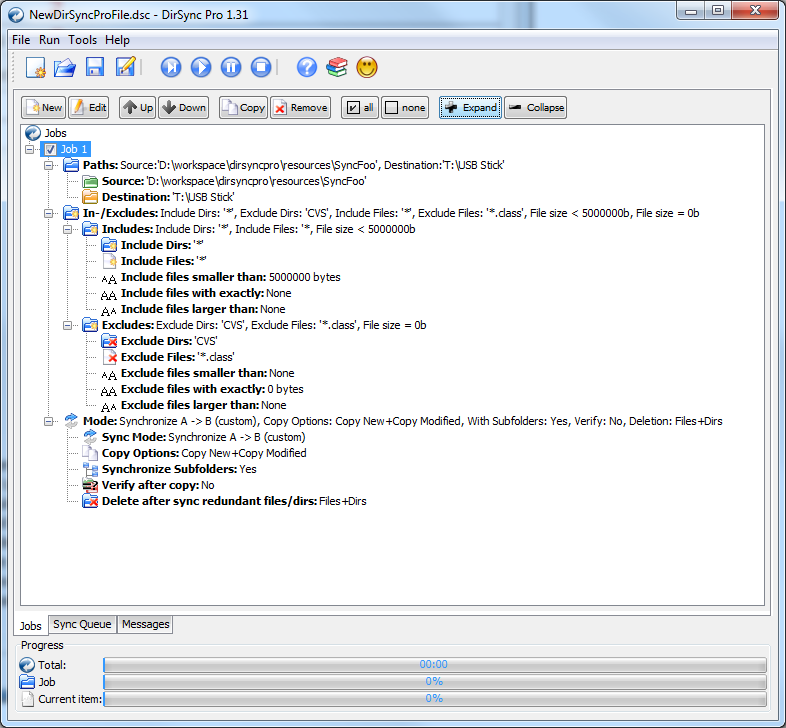
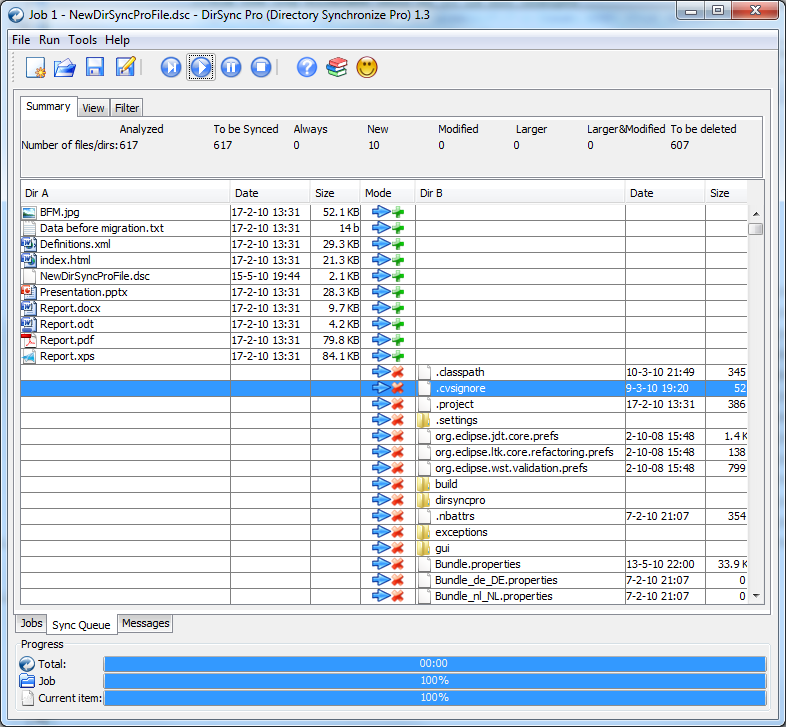

# Sync Directories

DirSync Pro is a small, but powerful utility for file and folder synchronization. DirSync Pro can be used to synchronize the content of one or many folders recursively. Use DirSync Pro to easily synchronize files from your desktop PC to your USB-stick (/Externa HD/PDA/Notebook, ...). Use this USB-stick (/Externa HD/PDA/Notebook, ...) to synchronize files to another desktop PC.

Using DirSync Pro you can make incremental backups. In this way you'll spare lots of time because you don't have to copy all the files each time you want to update your backup; only new/modified/larger files would be copied. DirSync Pro provides some preconfigured modes (e.g. Mirror, Backup, Contribute, …) for common synchronization and backup tasks and some custom modes in which the user could set up the synchronization behavior to meet specific wishes. Prior to synchronization, DirSync Pro perfoms an analysis on files and folders and detect any kind of changes to any file/directory in the source. If a file is for example modified, removed, deleted, renamed in the source DirSync Pro synchronizes the destination accordingly. DirSync Pro detects also changes to file meta data (e.g. DOS attributes, POSIX file ownerships/group/permissions) and could preserve them to the destination file/directories.

DirSync Pro has a user-friendly User Interface which helps you configure many options to your needs. You can use DirSync Pro also through the command line which makes it very flexible for running in batches.

DirSync Pro lets you define advanced filters based of filename patterns (textual and regular expression based), file sizes, modification dates, file paths and file meta data to include or exclude file/directories as desired.

DirSync Pro has a powerful schedule engine which lets you schedule synchronization tasks on many different ways, minutely, hourly, daily, weekly and monthly. Advanced users may use tons of options available in DirSync Pro to suit the synchronization behavior in details. DirSync Pro has many logging facilities which let you create detailed logs even per job.

DirSync Pro provides a real-time synchronization option which watches the source directory continuously and synchronizes the changes into the destination directory if a file/directory is changed.

Unlike many other synchronization software, DirSync Pro is Open Source; it is 100% free of charge, 100% free of commercial text, 100% free of advertisements and 100% free of spyware. You can use it as long as you like, without any limitations in time or functionality. You can freely distribute it according to GPL3.

DirSync Pro is programmed completely in platform independent Java™ so it can be run under nearly every modern operating system including Windows™, Linux™ and Macintosh™

[REFERANCE](https://www.dirsyncpro.org/)

## Screenshots

**Please note: Java JRE 1.7 or above is needed to run DirSync Pro.**

Here is the download page link

[DOWNLOAD](https://www.dirsyncpro.org/download.html)

